# SDN Topology Change Detection using POX & Mininet

---

## 📌 Problem Statement

This project implements a Software Defined Network (SDN) using **Mininet** and **POX Controller** to:

* Detect dynamic topology changes
* Maintain a live network map
* Implement a learning switch (L2 forwarding)
* Handle link failures and recovery
* Measure network performance (latency & throughput)

---

## 🏗️ Network Topology

Topology consists of:

* 2 Switches → `s1`, `s2`
* 2 Hosts → `h1`, `h2`

Connections:

* `h1 ↔ s1`
* `h2 ↔ s2`
* `s1 ↔ s2`

---

## 📂 Project Structure

```
.
├── controller/
│   └── topo_detect.py
├── topology/
│   └── topo.py
├── results/
│   └── (all screenshots here)
└── README.md
```

---

## 📜 Code Explanation

### 🔹 1. topo.py (Mininet Topology)

Defines the network structure.

* Creates switches using OpenFlow 1.0
* Adds hosts
* Connects switches and hosts

```python
s1 = self.addSwitch('s1', protocols='OpenFlow10')
s2 = self.addSwitch('s2', protocols='OpenFlow10')
```

👉 Ensures compatibility with POX

```python
self.addLink(s1, s2)
```

👉 Enables inter-switch communication

---

### 🔹 2. topo_detect.py (POX Controller)

Custom controller to detect topology changes.

#### Features:

* Tracks switches
* Tracks links
* Logs topology updates dynamically

---

### 🔸 Event Handling

#### Switch Connected

```python
_handle_ConnectionUp
```

#### Switch Disconnected

```python
_handle_ConnectionDown
```

#### Link Changes

```python
_handle_LinkEvent
```

---

### 🔸 Topology State

```python
self.switches = set()
self.links = set()
```

👉 Maintains live topology

---

### 🔸 Flow Rule Logic (Match–Action)

When a packet arrives at the switch:

1. **If no matching rule exists:**
   - Packet is sent to controller (packet_in)

2. **Controller behavior:**
   - Learns source MAC → port mapping
   - Checks destination MAC

3. **If destination is known:**
   - Installs flow rule:
     ```
     match: dl_dst=<MAC>
     action: output=<port>
     ```

4. **Else:**
   - Floods packet to all ports

👉 This reduces controller involvement after initial packets, improving performance through direct switch-to-switch forwarding.

---

## ⚙️ Detailed Execution Steps

### Step 1: Start POX Controller

```bash
cd ~/pox
./pox.py log.level --DEBUG openflow.discovery openflow.spanning_tree forwarding.l2_learning topo_detect
```

**Expected Output:**
- Controller starts and listens on default port 6633
- Logs show ready status for switch connections

---

### Step 2: Start Mininet (in another terminal)

```bash
sudo mn --custom topology/topo.py --topo mytopo --controller remote --switch ovsk
```

**Expected Output:**
- Mininet CLI prompt `mininet>`
- Switches s1, s2 connected to controller
- Hosts h1, h2 created

---

### Step 3: Test Connectivity

```bash
mininet> pingall
```

**Expected Output:**
- All pings succeed (100% success rate)
- Controller receives initial packet_in events

---

### Step 4: Check Flow Table (Before Learning)

```bash
mininet> sh ovs-ofctl dump-flows s1
```

**Expected Output:**
- Flow rule with action=CONTROLLER:65535
- Shows controller is handling all packets initially

---

### Step 5: Simulate Link Failure

```bash
mininet> link s1 s2 down
```

**Expected Output:**
- Link between switches is disabled
- Controller logs link removal event

---

### Step 6: Verify Failure

```bash
mininet> pingall
```

**Expected Output:**
- Ping between h1 and h2 fails (100% packet loss)
- Connectivity is broken as expected

---

### Step 7: Restore Link

```bash
mininet> link s1 s2 up
```

**Expected Output:**
- Link between switches is re-enabled
- Controller logs link discovery event

---

### Step 8: Verify Recovery

```bash
mininet> pingall
```

**Expected Output:**
- All pings succeed again (100% success rate)
- Connectivity fully restored

---

### Step 9: Check Flow Table (After Learning)

```bash
mininet> sh ovs-ofctl dump-flows s1
```

**Expected Output:**
- Flow rules now have action=output:<port_number>
- Shows controller has learned MAC addresses
- Direct forwarding is now active

---

### Step 10: Throughput Test

```bash
mininet> h1 iperf -s &
mininet> h2 iperf -c h1 -t 3
```

**Expected Output:**
- High throughput (~99 Gbps observed)
- Demonstrates efficient switch-based forwarding after learning

---

## 📸 Proof of Execution

### 🔹 Controller Startup

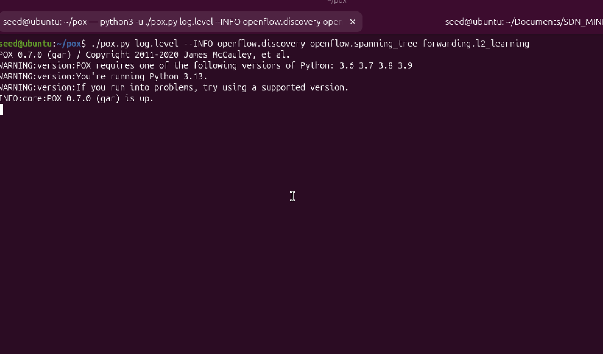

---

### 🔹 Mininet Topology Creation

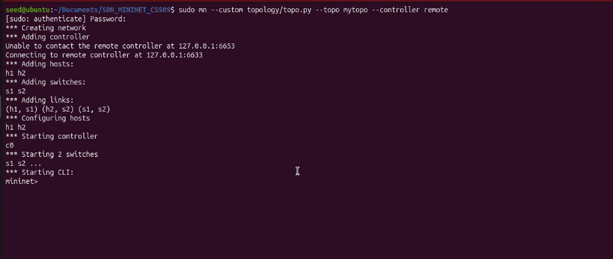

---

### 🔹 Ping Success

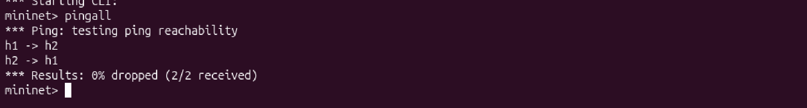

---

### 🔹 Initial Flow Table (Controller Handling)

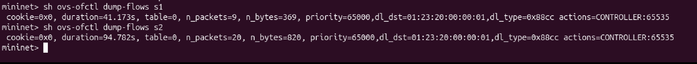

---

### 🔹 Link Down

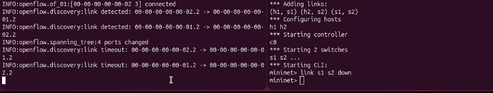

---

### 🔹 Ping Failure After Link Down

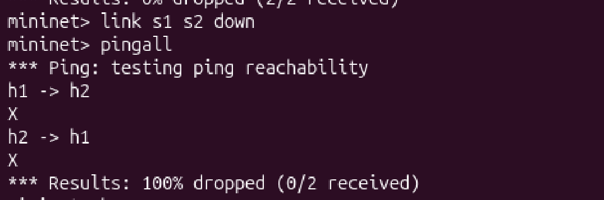

---

### 🔹 Flow Table After Failure

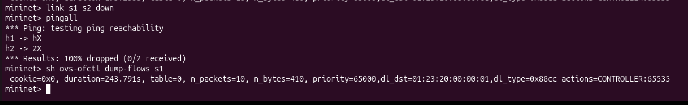

---

### 🔹 Link Up

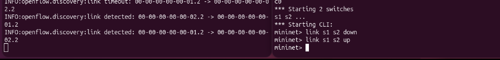

---

### 🔹 Ping Success After Recovery

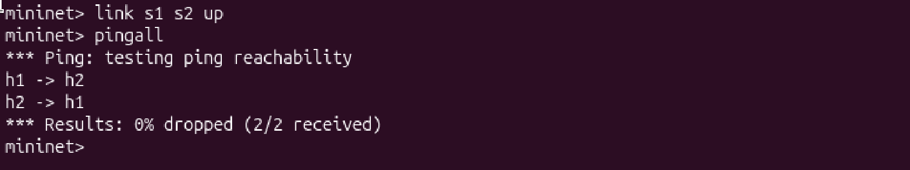

---

### 🔹 Flow Table After Learning ⭐

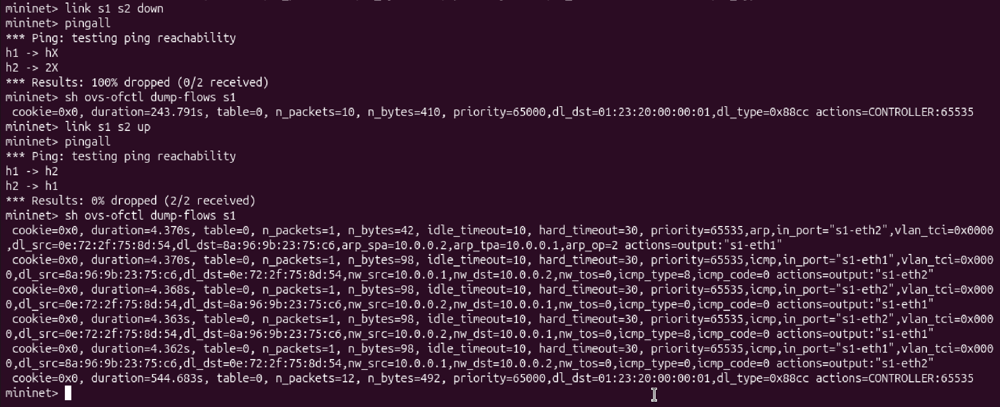

---

### 🔹 Iperf Throughput

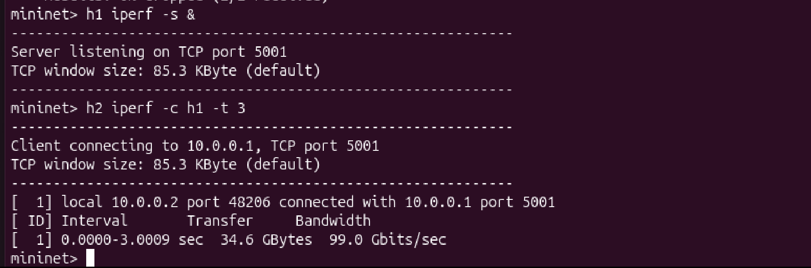

---

### 🔹 Link Detection Logs

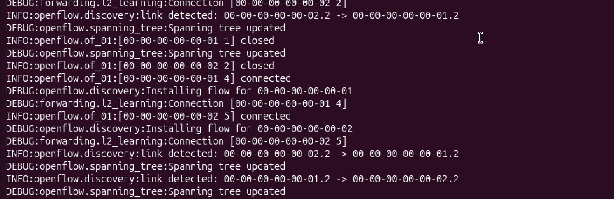

---

### 🔹 Link Timeout Logs

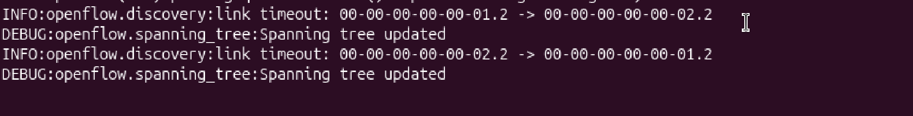

---

### 🔹 Flow Installation Logs

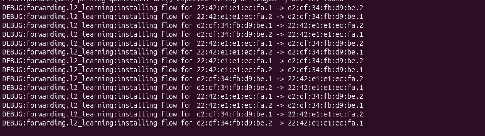

---

## 📊 Observations

### 🔹 Before Learning

* Packets sent to controller
* Flow:

```
actions=CONTROLLER
```

---

### 🔹 After Learning

* Switch installs rules
* Direct forwarding:

```
actions=output
```

---

### 🔹 Link Failure

* Ping fails (100% drop)
* Controller detects link removal

---

### 🔹 Link Recovery

* Connectivity restored
* New flow rules installed

---

### 🔹 Performance

* **High throughput (~99 Gbps observed)** with direct switch forwarding
* This is expected in Mininet as it runs in a virtual environment with no physical network constraints
* After flow installation, packets are forwarded directly by switches (action=output), improving performance
* Controller involvement is minimized after initial learning phase

---

## 📈 Evaluation Criteria Coverage

| Criteria              | Status |
| --------------------- | ------ |
| Problem Understanding | ✅      |
| SDN Logic             | ✅      |
| Functional Demo       | ✅      |
| Performance Analysis  | ✅      |
| Explanation           | ✅      |

---

## 🔍 Validation

* **Connectivity Verification:** Verified connectivity using `pingall` in normal operation (100% success)
* **Failure Verification:** Verified failure using `link s1 s2 down` → 100% packet loss between h1-h2
* **Recovery Verification:** Verified recovery using `link s1 s2 up` → 0% packet loss, all connectivity restored
* **Controller Behavior Verification:** Verified controller operation via:
  - Flow table inspection showing action=CONTROLLER before learning
  - Flow table inspection showing action=output after MAC learning
  - POX controller logs showing link detection and flow installation events

👉 All validations confirm correct SDN logic implementation

---

## 🔍 Validation

* **Connectivity Verification:** Verified connectivity using `pingall` in normal operation (100% success)
* **Failure Verification:** Verified failure using `link s1 s2 down` → 100% packet loss between h1-h2
* **Recovery Verification:** Verified recovery using `link s1 s2 up` → 0% packet loss, all connectivity restored
* **Controller Behavior Verification:** Verified controller operation via:
  - Flow table inspection showing action=CONTROLLER before learning
  - Flow table inspection showing action=output after MAC learning
  - POX controller logs showing link detection and flow installation events

👉 All validations confirm correct SDN logic implementation

---

## 🎯 Conclusion

This project successfully demonstrates:

* Dynamic topology detection
* SDN-based packet forwarding
* Fault tolerance (link failure & recovery)
* Performance evaluation using iperf

---

## 📚 References

* Mininet Documentation
* POX Controller Documentation
* OpenFlow Specification

---

## 👨‍💻 Author

* V.Saatwik
